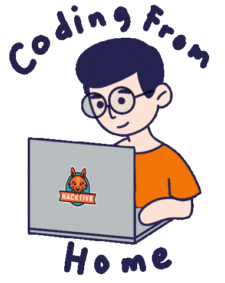

<div align="center">
    
</div>

###

<div align="center">
    <a href="https://www.linkedin.com/in/nureka-rodrigo/" target="_blank">
        
    </a>
    <a href="https://www.instagram.com/nureka_rodrigo/" target="_blank">
        
    </a>
</div>

###

<div align="center">
    
</div>

###

<h1 align="center">
    
</h1>

###

<h2 align="center">🐍 MY CONTRIBUTIONS 🐍</h2>

<div align="center">
    
</div>

###

<hr/>

###

<!--START_SECTION:waka-->


**I'm an Early 🐤** 

```text
🌞 Morning                735 commits         ████░░░░░░░░░░░░░░░░░░░░░   16.09 % 
🌆 Daytime                1634 commits        █████████░░░░░░░░░░░░░░░░   35.76 % 
🌃 Evening                1915 commits        ██████████░░░░░░░░░░░░░░░   41.91 % 
🌙 Night                  285 commits         ██░░░░░░░░░░░░░░░░░░░░░░░   06.24 % 
```
📅 **I'm Most Productive on Thursday** 

```text
Monday                   668 commits         ████░░░░░░░░░░░░░░░░░░░░░   14.62 % 
Tuesday                  651 commits         ████░░░░░░░░░░░░░░░░░░░░░   14.25 % 
Wednesday                624 commits         ███░░░░░░░░░░░░░░░░░░░░░░   13.66 % 
Thursday                 814 commits         ████░░░░░░░░░░░░░░░░░░░░░   17.82 % 
Friday                   654 commits         ████░░░░░░░░░░░░░░░░░░░░░   14.31 % 
Saturday                 665 commits         ████░░░░░░░░░░░░░░░░░░░░░   14.55 % 
Sunday                   493 commits         ███░░░░░░░░░░░░░░░░░░░░░░   10.79 % 
```


📊 **This Week I Spent My Time On** 

```text
🕑︎ Time Zone: Asia/Colombo

💬 Programming Languages: 
Other                    9 hrs 30 mins       ██████████░░░░░░░░░░░░░░░   41.52 % 
TypeScript               4 hrs 56 mins       █████░░░░░░░░░░░░░░░░░░░░   21.58 % 
JSON                     2 hrs 20 mins       ███░░░░░░░░░░░░░░░░░░░░░░   10.25 % 
Batchfile                2 hrs 1 min         ██░░░░░░░░░░░░░░░░░░░░░░░   08.82 % 
Python                   1 hr 43 mins        ██░░░░░░░░░░░░░░░░░░░░░░░   07.54 % 

🔥 Editors: 
Edge                     11 hrs 19 mins      ████████████░░░░░░░░░░░░░   49.40 % 
VS Code                  7 hrs 2 mins        ████████░░░░░░░░░░░░░░░░░   30.76 % 
PhpStorm                 3 hrs 5 mins        ███░░░░░░░░░░░░░░░░░░░░░░   13.49 % 
PyCharm                  1 hr 19 mins        █░░░░░░░░░░░░░░░░░░░░░░░░   05.75 % 
IntelliJ IDEA            8 mins              ░░░░░░░░░░░░░░░░░░░░░░░░░   00.60 % 

💻 Operating System: 
Windows                  22 hrs 54 mins      █████████████████████████   100.00 % 
```


 Last Updated on 11/03/2026 03:20:06 UTC
<!--END_SECTION:waka-->

###

<hr/>

###

<h2 align="center">⚡ MY STATS ⚡</h2>

###

<div align="center">
    <table>
        <tr>
            <td rowspan="2" align="center">
                
            </td>
        </tr>
        <tr>
            <td align="center">
                
            </td>
        </tr>
    </table>
</div>

<div align="center">

</div>

###

<hr/>

<div align="center">
    <table>
        <tr>
            <td align="center">
                <h2>🎧 LISTEN WITH ME 🎧</h2>
                <a href="https://open.spotify.com/user/zjqfkmbawszam1irs05fwxsls">
                    
                </a>
            </td>
            <td align="center">
                <h2>👨‍💻 CODE WITH ME 👨‍💻</h2>
                
            </td>
        </tr>
    </table>
</div>

###

<hr/>
