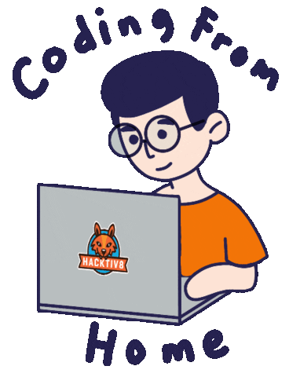

<div align="center">
    
</div>

###

<div align="center">
    <a href="https://www.linkedin.com/in/nureka-rodrigo/" target="_blank">
        
    </a>
    <a href="https://www.instagram.com/nureka_rodrigo/" target="_blank">
        
    </a>
</div>

###

<div align="center">
    
</div>

###

<h1 align="center">
    
</h1>

###

<h2 align="center">🐍 MY CONTRIBUTIONS 🐍</h2>

<div align="center">
    
</div>

###

<hr/>

###

<!--START_SECTION:waka-->


**I'm an Early 🐤** 

```text
🌞 Morning                718 commits         ████░░░░░░░░░░░░░░░░░░░░░   17.88 % 
🌆 Daytime                1333 commits        ████████░░░░░░░░░░░░░░░░░   33.20 % 
🌃 Evening                1704 commits        ███████████░░░░░░░░░░░░░░   42.44 % 
🌙 Night                  260 commits         ██░░░░░░░░░░░░░░░░░░░░░░░   06.48 % 
```
📅 **I'm Most Productive on Thursday** 

```text
Monday                   542 commits         ███░░░░░░░░░░░░░░░░░░░░░░   13.50 % 
Tuesday                  518 commits         ███░░░░░░░░░░░░░░░░░░░░░░   12.90 % 
Wednesday                577 commits         ████░░░░░░░░░░░░░░░░░░░░░   14.37 % 
Thursday                 767 commits         █████░░░░░░░░░░░░░░░░░░░░   19.10 % 
Friday                   612 commits         ████░░░░░░░░░░░░░░░░░░░░░   15.24 % 
Saturday                 608 commits         ████░░░░░░░░░░░░░░░░░░░░░   15.14 % 
Sunday                   391 commits         ██░░░░░░░░░░░░░░░░░░░░░░░   09.74 % 
```


📊 **This Week I Spent My Time On** 

```text
🕑︎ Time Zone: Asia/Colombo

💬 Programming Languages: 
TypeScript               3 hrs 34 mins       ██████████░░░░░░░░░░░░░░░   39.52 % 
Python                   2 hrs 5 mins        ██████░░░░░░░░░░░░░░░░░░░   23.08 % 
Java                     1 hr 49 mins        █████░░░░░░░░░░░░░░░░░░░░   20.18 % 
Markdown                 1 hr 3 mins         ███░░░░░░░░░░░░░░░░░░░░░░   11.62 % 
TeX                      7 mins              ░░░░░░░░░░░░░░░░░░░░░░░░░   01.40 % 

🔥 Editors: 
Claude Code              5 hrs 57 mins       ████████████████░░░░░░░░░   65.82 % 
IntelliJ IDEA            1 hr 53 mins        █████░░░░░░░░░░░░░░░░░░░░   20.81 % 
VS Code                  1 hr 12 mins        ███░░░░░░░░░░░░░░░░░░░░░░   13.36 % 

💻 Operating System: 
Windows                  9 hrs 3 mins        █████████████████████████   100.00 % 
```

🤖 **AI Coding This Week** 

```text
⏱ AI Coding Time: 6 hrs 56 mins (76.64%)

✍️ 5,013 lines written by AI, 264 lines written by hand (95.0% AI-written)

🔤 238,633,156 Input Tokens, 573,328 Output Tokens

💵 $1073.03 Estimated AI Cost This Week

🧠 10 AI Sessions, 66 AI Prompts

Opus                     3,901 lines         ██████████████████░░░░░░░   70.85 % 
Sonnet                   1,605 lines         ███████░░░░░░░░░░░░░░░░░░   29.15 % 

🔎 AI Coding Insights:
🤖 AI-Driven — 95.0% of written lines came from AI
📝 Concise Prompter — average 213 characters per prompt
🔁 Iterative Prompter — average 7 prompts per session
🚀 High AI Trust — 5.74% of changed lines were hand-edited
```


 Last Updated on 01/08/2026 04:08:55 UTC
<!--END_SECTION:waka-->

###

<hr/>

###

<h2 align="center">⚡ MY STATS ⚡</h2>

###

<div align="center">
    <table>
        <tr>
            <td rowspan="2" align="center">
                
            </td>
        </tr>
        <tr>
            <td align="center">
                
            </td>
        </tr>
    </table>
</div>

<div align="center">

</div>

###

<hr/>

<div align="center">
    <table>
        <tr>
            <td align="center">
                <h2>🎧 LISTEN WITH ME 🎧</h2>
                <a href="https://open.spotify.com/user/zjqfkmbawszam1irs05fwxsls">
                    
                </a>
            </td>
            <td align="center">
                <h2>👨‍💻 CODE WITH ME 👨‍💻</h2>
                
            </td>
        </tr>
    </table>
</div>

###

<hr/>
