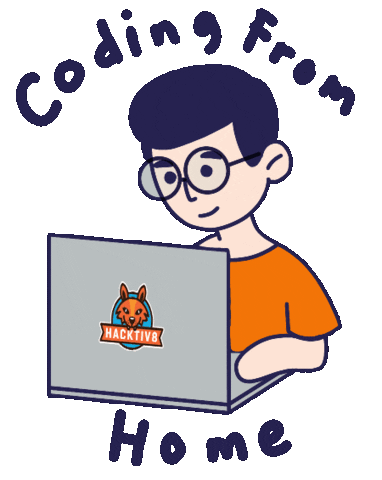

<div align="center">
    
</div>

###

<div align="center">
    <a href="https://www.linkedin.com/in/nureka-rodrigo/" target="_blank">
        
    </a>
    <a href="https://www.instagram.com/nureka_rodrigo/" target="_blank">
        
    </a>
</div>

###

<div align="center">
    
</div>

###

<h1 align="center">
    
</h1>

###

<h2 align="center">🐍 MY CONTRIBUTIONS 🐍</h2>

<div align="center">
    
</div>

###

<hr/>

###

<!--START_SECTION:waka-->


**I'm an Early 🐤** 

```text
🌞 Morning                441 commits         █████░░░░░░░░░░░░░░░░░░░░   20.09 % 
🌆 Daytime                720 commits         ████████░░░░░░░░░░░░░░░░░   32.80 % 
🌃 Evening                912 commits         ██████████░░░░░░░░░░░░░░░   41.55 % 
🌙 Night                  122 commits         █░░░░░░░░░░░░░░░░░░░░░░░░   05.56 % 
```
📅 **I'm Most Productive on Monday** 

```text
Monday                   398 commits         █████░░░░░░░░░░░░░░░░░░░░   18.13 % 
Tuesday                  330 commits         ████░░░░░░░░░░░░░░░░░░░░░   15.03 % 
Wednesday                327 commits         ████░░░░░░░░░░░░░░░░░░░░░   14.90 % 
Thursday                 314 commits         ████░░░░░░░░░░░░░░░░░░░░░   14.31 % 
Friday                   292 commits         ███░░░░░░░░░░░░░░░░░░░░░░   13.30 % 
Saturday                 261 commits         ███░░░░░░░░░░░░░░░░░░░░░░   11.89 % 
Sunday                   273 commits         ███░░░░░░░░░░░░░░░░░░░░░░   12.44 % 
```


📊 **This Week I Spent My Time On** 

```text
🕑︎ Time Zone: Asia/Colombo

💬 Programming Languages: 
Python                   4 hrs 22 mins       █████████░░░░░░░░░░░░░░░░   36.43 % 
Markdown                 2 hrs 53 mins       ██████░░░░░░░░░░░░░░░░░░░   24.02 % 
Log                      2 hrs 43 mins       ██████░░░░░░░░░░░░░░░░░░░   22.64 % 
TypeScript               35 mins             █░░░░░░░░░░░░░░░░░░░░░░░░   05.00 % 
Text                     30 mins             █░░░░░░░░░░░░░░░░░░░░░░░░   04.29 % 

🔥 Editors: 
Claude Code              9 hrs 15 mins       ███████████████████░░░░░░   77.10 % 
IntelliJ IDEA            2 hrs 44 mins       ██████░░░░░░░░░░░░░░░░░░░   22.90 % 

💻 Operating System: 
Windows                  12 hrs              █████████████████████████   100.00 % 
```

🤖 **AI Coding This Week** 

```text
⏱ AI Coding Time: 10 hrs 24 mins (86.76%)

✍️ 12,947 lines written by AI, 4,769 lines written by hand (73.08% AI-written)

🔤 11,356,576 Input Tokens, 1,216,732 Output Tokens

💵 $152.60 Estimated AI Cost This Week

🧠 15 AI Sessions, 51 AI Prompts

Sonnet                   10,638 lines        ████████████████████░░░░░   81.90 % 
Opus                     2,351 lines         █████░░░░░░░░░░░░░░░░░░░░   18.10 % 

🔎 AI Coding Insights:
🤖 AI-Driven — 73.08% of written lines came from AI
📚 Verbose Prompter — average 3,742 characters per prompt
🔁 Iterative Prompter — average 3 prompts per session
🔍 Hands-On Reviewer — 70.92% of changed lines were hand-edited
```


 Last Updated on 06/10/2026 06:42:34 UTC
<!--END_SECTION:waka-->

###

<hr/>

###

<h2 align="center">⚡ MY STATS ⚡</h2>

###

<div align="center">
    <table>
        <tr>
            <td rowspan="2" align="center">
                
            </td>
        </tr>
        <tr>
            <td align="center">
                
            </td>
        </tr>
    </table>
</div>

<div align="center">

</div>

###

<hr/>

<div align="center">
    <table>
        <tr>
            <td align="center">
                <h2>🎧 LISTEN WITH ME 🎧</h2>
                <a href="https://open.spotify.com/user/zjqfkmbawszam1irs05fwxsls">
                    
                </a>
            </td>
            <td align="center">
                <h2>👨‍💻 CODE WITH ME 👨‍💻</h2>
                
            </td>
        </tr>
    </table>
</div>

###

<hr/>
