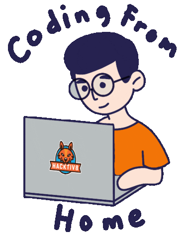

<div align="center">
    
</div>

###

<div align="center">
    <a href="https://www.linkedin.com/in/nureka-rodrigo/" target="_blank">
        
    </a>
    <a href="https://www.instagram.com/nureka_rodrigo/" target="_blank">
        
    </a>
</div>

###

<div align="center">
    
</div>

###

<h1 align="center">
    
</h1>

###

<h2 align="center">🐍 MY CONTRIBUTIONS 🐍</h2>

<div align="center">
    
</div>

###

<hr/>

###

<!--START_SECTION:waka-->


**I'm an Early 🐤** 

```text
🌞 Morning                1902 commits        ████████░░░░░░░░░░░░░░░░░   30.20 % 
🌆 Daytime                2698 commits        ███████████░░░░░░░░░░░░░░   42.84 % 
🌃 Evening                1530 commits        ██████░░░░░░░░░░░░░░░░░░░   24.29 % 
🌙 Night                  168 commits         █░░░░░░░░░░░░░░░░░░░░░░░░   02.67 % 
```
📅 **I'm Most Productive on Tuesday** 

```text
Monday                   676 commits         ███░░░░░░░░░░░░░░░░░░░░░░   10.73 % 
Tuesday                  2650 commits        ███████████░░░░░░░░░░░░░░   42.08 % 
Wednesday                897 commits         ████░░░░░░░░░░░░░░░░░░░░░   14.24 % 
Thursday                 1030 commits        ████░░░░░░░░░░░░░░░░░░░░░   16.35 % 
Friday                   410 commits         ██░░░░░░░░░░░░░░░░░░░░░░░   06.51 % 
Saturday                 296 commits         █░░░░░░░░░░░░░░░░░░░░░░░░   04.70 % 
Sunday                   339 commits         █░░░░░░░░░░░░░░░░░░░░░░░░   05.38 % 
```


📊 **This Week I Spent My Time On** 

```text
🕑︎ Time Zone: Asia/Colombo

💬 Programming Languages: 
Markdown                 4 hrs 42 mins       ███████░░░░░░░░░░░░░░░░░░   26.88 % 
Python                   4 hrs 23 mins       ██████░░░░░░░░░░░░░░░░░░░   25.13 % 
TypeScript               4 hrs 10 mins       ██████░░░░░░░░░░░░░░░░░░░   23.86 % 
HTML                     1 hr 31 mins        ██░░░░░░░░░░░░░░░░░░░░░░░   08.75 % 
Other                    48 mins             █░░░░░░░░░░░░░░░░░░░░░░░░   04.63 % 

🔥 Editors: 
Claude Code              16 hrs 29 mins      ████████████████████████░   94.18 % 
IntelliJ IDEA            1 hr 1 min          █░░░░░░░░░░░░░░░░░░░░░░░░   05.82 % 

💻 Operating System: 
Windows                  17 hrs 30 mins      █████████████████████████   100.00 % 
```

🤖 **AI Coding This Week** 

```text
⏱ AI Coding Time: 17 hrs 5 mins (97.62%)

✍️ 28,773 lines written by AI, 2 lines written by hand (99.99% AI-written)

🔤 12,269,925 Input Tokens, 2,242,897 Output Tokens

💵 $219.11 Estimated AI Cost This Week

🧠 23 AI Sessions, 126 AI Prompts

Opus                     29,238 lines        ████████████████████████░   95.69 % 
Sonnet                   1,316 lines         █░░░░░░░░░░░░░░░░░░░░░░░░   04.31 % 
Haiku                    0 lines             ░░░░░░░░░░░░░░░░░░░░░░░░░   00.00 % 

🔎 AI Coding Insights:
🤖 AI-Driven — 99.99% of written lines came from AI
📚 Verbose Prompter — average 1,550 characters per prompt
🔁 Iterative Prompter — average 5 prompts per session
🚀 High AI Trust — 0.56% of changed lines were hand-edited
```


 Last Updated on 25/11/2026 09:02:02 UTC
<!--END_SECTION:waka-->

###

<hr/>

###

<h2 align="center">⚡ MY STATS ⚡</h2>

###

<div align="center">
    <table>
        <tr>
            <td rowspan="2" align="center">
                
            </td>
        </tr>
        <tr>
            <td align="center">
                
            </td>
        </tr>
    </table>
</div>

<div align="center">

</div>

###

<hr/>

<div align="center">
    <table>
        <tr>
            <td align="center">
                <h2>🎧 LISTEN WITH ME 🎧</h2>
                <a href="https://open.spotify.com/user/zjqfkmbawszam1irs05fwxsls">
                    
                </a>
            </td>
            <td align="center">
                <h2>👨‍💻 CODE WITH ME 👨‍💻</h2>
                
            </td>
        </tr>
    </table>
</div>

###

<hr/>
